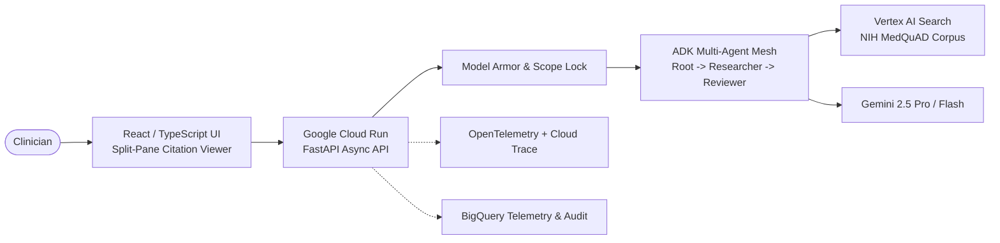

# MedQuAD Clinical Assistant — Google Cloud FDE Capstone Project

> **Shortlink:** `go/fde-capstone-project`  
> **Team:** GTM FDE (`github.com/cloud-ai-fde`)  
> **Architecture:** ADK Multi-Agent Mesh • Vertex AI Search • Gemini 2.5 • Model Armor • OpenTelemetry • Terraform Multi-Env

---

## Overview

**MedQuAD Clinical Assistant** is a production-grade multi-agent biomedical research platform engineered for Google Cloud Platform. It empowers healthcare researchers and clinicians to query peer-reviewed NIH medical literature with verifiable inline citations, zero hallucinations, non-diagnostic guardrails, and enterprise observability.

---

## Key Architecture & Features



* **Hierarchical ADK Mesh**: Root Orchestrator supervises specialized Researcher and Reviewer subagents.
* **Dual-Layer AI Safety**: Model Armor filters prompt injections & redacts PII; Scope Lock deterministically prevents unauthorized medical diagnoses.
* **Multi-Environment Terraform**: Modular IaC supporting isolated `dev`, `staging`, and `prod` environments with Cloud Build CI/CD pipelines.
* **OpenTelemetry & Cloud Trace**: End-to-end distributed tracing correlated with structured Cloud Logging.
* **Granular Cost Accounting**: Real-time token usage and cost calculation streaming to BigQuery.

---

## Directory Structure

```
fde_medquad_assistant/
├── cicd/                     # Cloud Build CI/CD pipelines (CI, CD Dev, CD Staging, CD Prod)
├── terraform/                # Multi-Environment Terraform (modules/ & environments/)
│   ├── modules/              # cloud_run, vertex_search, storage, iam, bigquery, secrets, networking
│   └── environments/         # dev/, staging/, prod/
├── src/
│   ├── backend/              # FastAPI application, ADK agents, tools, safety, telemetry
│   ├── frontend/             # React 18 + TypeScript + Tailwind CSS UI (Split-Pane Viewer)
│   └── data_pipeline/        # MedQuAD dataset loader & Vertex AI Search ingestion scripts
├── tests/                    # Comprehensive Pytest test suite & heuristic evaluations
└── docs/                     # High-Level Architecture, ADRs, OpenAPI specs, Runbooks, Slide Deck
```

---

## Quick Start

### 1. Backend Local Setup
```bash
cd src/backend
pip install -r requirements.txt
uvicorn app.main:app --reload --port 8080
```

### 2. Frontend Setup
```bash
cd src/frontend
npm install
npm run dev
```

### 3. Run Test & Evaluation Suite
```bash
PYTHONPATH=src/backend pytest tests/ -v --cov=src/backend/app --cov-report=term-missing
```

### 4. Deploy Infrastructure (Dev)
```bash
cd terraform/environments/dev
terraform init
terraform plan
terraform apply
```

---

## Documentation & Deliverables
* [High-Level Architecture (HLA)](docs/architecture/high_level_architecture.md)
* [Architecture Decision Records (ADRs)](docs/adrs/)
* [Deployment Runbook](docs/runbooks/deployment_runbook.md)
* [Troubleshooting Guide](docs/runbooks/troubleshooting.md)
* [Customer Presentation Slide Deck (Panel Defense)](docs/presentation/slide_deck_structure.md)
