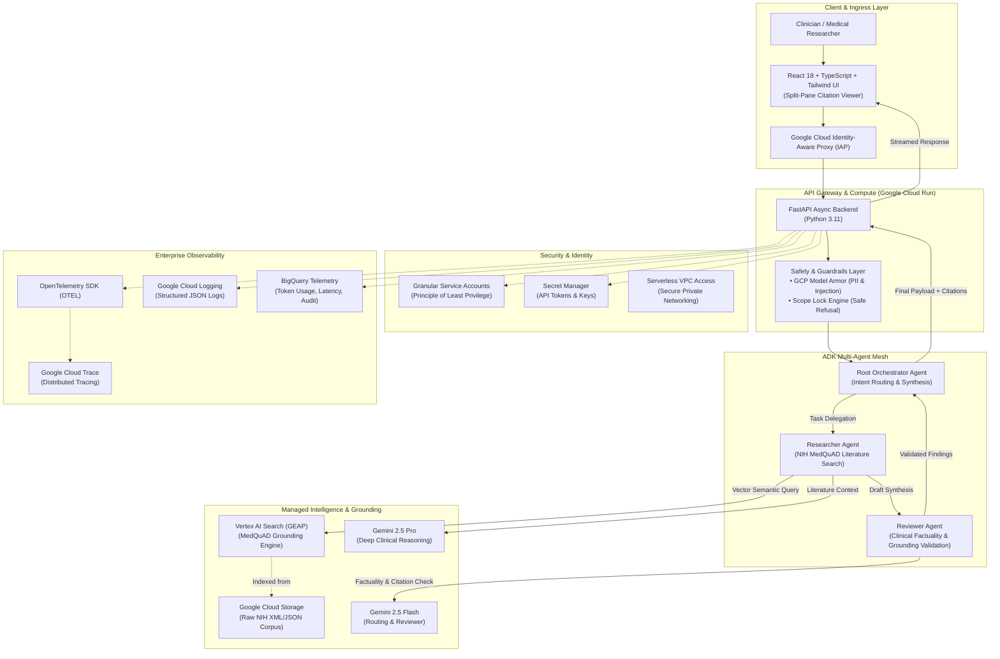
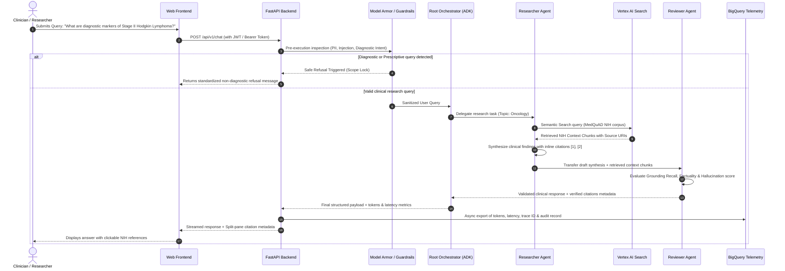

# High-Level Architecture (HLA) — MedQuAD Clinical Assistant

## 1. Executive Summary

**MedQuAD Clinical Assistant** is an enterprise-grade multi-agent clinical research platform engineered for Google Cloud Platform (GCP). It enables medical researchers and clinicians to query authoritative NIH literature rapidly and safely, guaranteeing zero-hallucination policies, non-diagnostic guardrails, least-privilege IAM security, and comprehensive observability.

---

## 2. Multi-Agent Orchestration Flow

---

## 3. Core Architectural Decisions

1. **Multi-Agent Separation of Concerns**: Instead of a monolithic prompt, the system decouples search, synthesis, and validation into specialized agents orchestrated by Google ADK.
2. **Model Tiering Strategy**: High-frequency routing and review operations execute on **Gemini 2.5 Flash** (<400ms latency, 10x lower cost), while intensive medical synthesis runs on **Gemini 2.5 Pro**.
3. **Defense-in-Depth AI Safety**: Model Armor intercepts adversarial prompts and redacts PII before model calls, while a deterministic Scope Lock engine guarantees that the assistant never offers medical diagnoses or treatment prescriptions.
4. **End-to-End Observability**: Standardized OpenTelemetry tracing correlates HTTP requests, agent spans, tool calls, and model invocations into Google Cloud Trace, with granular token usage materializing in BigQuery for Looker financial reporting.
