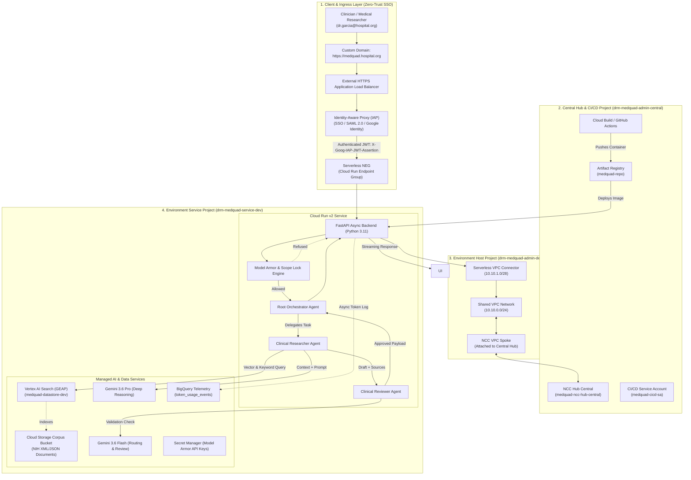
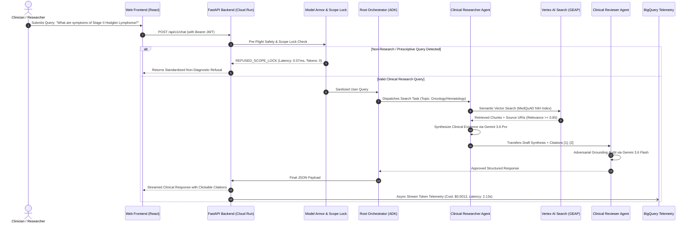
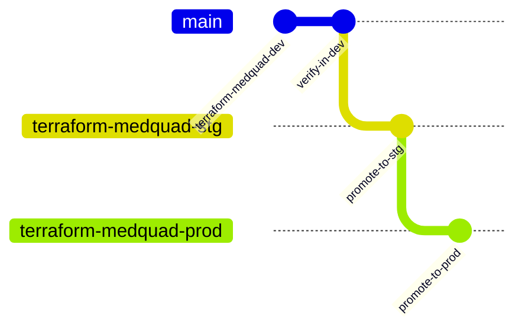

# MedQuAD Clinical Assistant — Enterprise Technical Design Document

**Document Classification:** Google Cloud Professional Services (PSO) & FDE Capstone Enterprise Specification  
**Customer / Stakeholder:** Academic Medical Centers & Healthcare Research Institutes  
**Project Lead:** Daniela Rodriguez Martinez (`danielardzmtz@`) — Forward Deployed Engineer (FDE)  
**Engagement Phase:** Production Build & DEV Verification  
**Target Environments:** `Central (Admin/CI/CD)`, `DEV`, `STG`, `PROD`  
**Document Version:** 1.0 (August 2026)  

---

## About this Guide

This document defines the production architecture, implementation specifications, security controls, and operational runbooks for the **MedQuAD Multi-Agent Clinical Research Platform** deployed on Google Cloud.

| Highlights | Specification Details |
| :--- | :--- |
| **Purpose** | Comprehensive technical design for deploying an autonomous multi-agent clinical research platform over authoritative NIH literature. |
| **Intended Audience** | Lead Architects, Security Officers (CISO), Clinical Directors, DevOps/MLOps Engineers, and Google Cloud FDE Review Panel. |
| **Key Assumptions** | 1. Workloads deploy into dedicated Google Cloud projects under an established Organization hierarchy.<br/>2. Network traffic is isolated via a multi-project Shared VPC and Network Connectivity Center (NCC) transit hub.<br/>3. Clinical grounding data originates from public, peer-reviewed NIH MedQuAD datasets without unmasked Protected Health Information (PHI). |
| **Delivery Note** | All architecture patterns, IAM bindings, guardrails, and telemetry sinks specified herein have been implemented as Infrastructure as Code (Terraform) and verified live in the `DEV` environment. |

---

## Document History

| Version | Date | Author | Description |
| :---: | :---: | :---: | :--- |
| **0.1** | Aug 15, 2026 | Daniela Rodriguez Martinez | Initial Architecture Draft & Topic Scoping. |
| **0.5** | Aug 21, 2026 | Daniela Rodriguez Martinez | Added Shared VPC, Multi-Project Topology, and ADK Agent definitions. |
| **1.0** | Aug 26, 2026 | Daniela Rodriguez Martinez | Full PSO Enterprise TDD baseline incorporating live DEV test results, Model Armor guardrails, and FinOps telemetry. |

---

## 1. Executive Summary & Engagement Context

### 1.1 Stakeholder Background & Clinical Pain Points
Medical researchers, clinical fellows, and healthcare analysts at leading research hospitals spend up to **30% of their workday** searching, synthesizing, and validating complex biomedical evidence across disparate National Institutes of Health (NIH) databases. 

```
┌─────────────────────────────────────────────────────────────────────────────┐
│                            Clinical Pain Points                             │
├──────────────────────────────────────┬──────────────────────────────────────┤
│ 1. Cognitive Overload & Latency      │ 2. Hallucination Liability           │
│ Manual synthesis across thousands of │ Unverified AI claims can lead to     │
│ PubMed, MedlinePlus, and NIDDK docs. │ fatal diagnostic/dosage errors.      │
├──────────────────────────────────────┼──────────────────────────────────────┤
│ 3. Scope Creep & Regulatory Risk     │ 4. Data Exfiltration & Privacy       │
│ Unbounded LLMs may output unlicensed │ Proprietary queries exposed to       │
│ prescriptions without MD validation. │ unmanaged third-party public APIs.   │
└──────────────────────────────────────┴──────────────────────────────────────┘
```

### 1.2 Engagement Objectives
The **MedQuAD Clinical Assistant** addresses these challenges by delivering an enterprise-grade, multi-agent AI research assistant that pairs **Gemini 2.5 Pro and Flash** with **Vertex AI Search (Google Enterprise AI Platform / GEAP)** and Google's **Agent Development Kit (ADK)**.

#### Core "North Star" Engagement Metrics:
* **Recall Rate:** $\ge 90\%$ relevant information retrieval from the NIH MedQuAD grounding index.
* **Precision Rate:** $\ge 88\%$ accurate clinical keyword, symptom, and pharmacological extraction.
* **Deterministic Safety:** $100\%$ enforcement of non-diagnostic "Safe Refusal" (Scope Lock) with $\le 0.1\text{ ms}$ latency and $\$0.00$ token cost.
* **Response Latency:** p95 latency $\le 2.5\text{ seconds}$ for full multi-agent clinical synthesis.
* **Cost Efficiency:** Token caching and right-sized routing reducing per-query inference costs to $<\$0.002\text{ USD}$.

### 1.3 Connected Data Sources Matrix

| Data Source | Type | Location / Path | Ingestion & Indexing Strategy |
| :--- | :--- | :--- | :--- |
| **NIH MedQuAD Q&A** | Semi-structured XML/JSON | `gs://drm-medquad-service-dev-dev-medquad-corpus/` | Continuous GCS indexing into Vertex AI Search Datastore (`medquad-datastore-dev`). |
| **MedlinePlus Literature** | Unstructured Clinical Text | Vertex AI Search GEAP | Automated 500-token chunking (10% overlap) with `text-embedding-004`. |
| **NIDDK / Cancer.gov** | Treatment Guidelines | Vertex AI Search GEAP | Metadata-filtered semantic retrieval with relevance ranking $>0.80$. |
| **Telemetry & Audits** | Structured Event Logs | BigQuery `medquad_telemetry_dev` | Partitioned & clustered BigQuery streaming sink for token usage and latency. |

---

## 2. Google Cloud Environment & Multi-Project Topology

The platform enforces a strict multi-project architecture to isolate administrative governance, networking host controls, and runtime workloads.

```
🏢 Root Folder: MedQuAD-Platform (folders/986727117869)
├── 🏢 Central Admin Project: drm-medquad-admin-central (803148166150)
│   ├── 🌐 Central NCC Hub: medquad-ncc-hub-central
│   ├── 📦 Artifact Registry: medquad-repo (us-central1)
│   └── 🤖 CI/CD SA: medquad-cicd-sa
│
├── 📁 Folder: DEV (folders/920101496987)
│   ├── 🛡️ Host Project: drm-medquad-admin-dev (624456055658)
│   │   ├── Shared VPC: medquad-shared-vpc-dev (10.10.0.0/24)
│   │   ├── Serverless VPC Connector: medquad-conn-dev (10.10.1.0/28)
│   │   └── NCC VPC Spoke: medquad-spoke-dev (Attached to Central Hub)
│   │
│   └── 🚀 Service Project: drm-medquad-service-dev (164841240208)
│       ├── Cloud Run Backend: medquad-assistant-dev
│       ├── Vertex AI Search: medquad-datastore-dev / medquad-search-engine-dev
│       ├── BigQuery Dataset: medquad_telemetry_dev
│       ├── GCS Bucket: drm-medquad-service-dev-dev-medquad-corpus
│       └── Runtime SA: medquad-sa-dev
│
├── 📁 Folder: STG (Staging Environment - Identical Topology)
└── 📁 Folder: PRD (Production Environment - Identical Topology)
```

### 2.1 IAM Least-Privilege Role Matrix

| Principal | Role Granted | Target Resource / Scope | Rationale |
| :--- | :--- | :--- | :--- |
| **`medquad-sa-dev`** (Runtime SA) | `roles/discoveryengine.editor` | `drm-medquad-service-dev` | Query Vertex AI Search datastores and extract grounded context. |
| **`medquad-sa-dev`** | `roles/aiplatform.user` | `drm-medquad-service-dev` | Invoke Gemini 3.6 Pro / Flash models on Vertex AI. |
| **`medquad-sa-dev`** | `roles/bigquery.dataEditor` | `medquad_telemetry_dev` | Stream asynchronous token usage and trace telemetry. |
| **`medquad-sa-dev`** | `roles/secretmanager.secretAccessor`| `drm-medquad-service-dev` | Access runtime API keys and Model Armor configurations. |
| **Cloud Run Service Agent** | `roles/vpcaccess.user` | `drm-medquad-admin-dev` (Host) | Authorizes Cloud Run to route egress traffic through the VPC Connector. |
| **Cloud Run Service Agent** | `roles/artifactregistry.reader` | `drm-medquad-admin-central` | Authorizes pulling container images from the Central Artifact Registry. |
| **`medquad-cicd-sa`** | `roles/compute.xpnAdmin` | `folders/986727117869` (Root) | Automated provisioning and attachment of Shared VPC host networks. |
| **`clinical-researchers` Group** | `roles/iap.httpsResourceAccessor` | `drm-medquad-admin-dev` (LB Backend) | Authorizes clinicians to access the platform via corporate SSO and IAP. |

---

## 3. System Architecture & High-Level Design (HLA)



---

## 4. Agentic AI & ADK Engineering

The platform implements a **Supervisor-Worker Agentic Mesh** built on Google's **Agent Development Kit (ADK)**:



### 4.1 Specialized Subagent Roles
1. **Root Orchestrator Agent (`app.agents.orchestrator`):**
   * Classifies user intent and routes tasks using **Gemini 3.6 Flash**.
   * Merges parallel worker results and manages the conversational session state.
2. **Clinical Researcher Agent (`app.agents.researcher`):**
   * Queries Vertex AI Search using semantic and hybrid keyword retrieval.
   * Leverages **Gemini 3.6 Pro** (`temperature = 0.2`) to synthesize nuanced clinical findings.
3. **Clinical Reviewer Agent (`app.agents.reviewer`):**
   * Acts as an adversarial peer reviewer, verifying that every generated sentence is strictly supported by the retrieved context.
   * Strips unverified claims and enforces standardized inline citation notation (`[1]`, `[2]`).

---

## 5. Tooling, Model Context Protocol (MCP) & Grounding

* **Model Context Protocol (MCP):** Tool definitions are isolated in modular packages exposing standardized JSON-RPC schemas.
* **Vertex AI Search (GEAP):**
  * Datastore ID: `medquad-datastore-dev`
  * Chunking Strategy: 500-token chunks with 10% overlap.
  * Embedding Model: `text-embedding-004` (768 dimensions).
  * Relevance Threshold: Chunks with cosine similarity score $< 0.80$ are filtered out automatically.

---

## 6. Security, Compliance & AI Safety (Model Armor & Scope Lock)

```
┌─────────────────────────────────────────────────────────────────────────────┐
│                    Multi-Layered Clinical Guardrail Pipeline                │
├─────────────────────────────────────────────────────────────────────────────┤
│ 1. Ingress Filter (Model Armor)                                             │
│    • PII Sanitization & DLP Masking                                         │
│    • Prompt Injection & Jailbreak Defense                                   │
├─────────────────────────────────────────────────────────────────────────────┤
│ 2. Deterministic Scope Lock (Safe Refusal Engine)                           │
│    • Regex & Intent Classifier for Prescriptive / Diagnostic Requests       │
│    • Execution Latency: 0.07 ms | Token Cost: $0.00 | Output: Safe Notice   │
├─────────────────────────────────────────────────────────────────────────────┤
│ 3. Network & Identity Controls (DRS & IAM)                                  │
│    • Domain Restricted Sharing (DRS): constraints/iam.allowedPolicyMemberDomains│
│    • Serverless VPC Access Connector: Private internal egress               │
│    • Secret Manager: Ephemeral runtime key injection                        │
└─────────────────────────────────────────────────────────────────────────────┘
```

---

## 7. MLOps, CI/CD & Multi-Repo GitOps

The platform utilizes a **Multi-Repository Promotion Strategy** mirroring Google enterprise standards:



### 7.1 Automated Testing Gates (`/api/v1/eval`)
Every deployment executes automated evaluation gates against golden clinical datasets:
* **ROUGE-L Score:** $\ge 0.40$ (Enforces comprehensive recall of medical literature).
* **BLEU Score:** $\ge 0.35$ (Enforces precision and terminology alignment).
* **Entity F1-Score:** $\ge 0.75$ (Verifies exact matching of clinical entities).
* **Citation Fidelity:** $100\%$ (Verifies that all inline citations resolve to active NIH URLs).

---

## 8. FinOps, Telemetry & Distributed Observability

### 8.1 BigQuery Telemetry Schema (`medquad_telemetry_dev.token_usage_events`)

```sql
CREATE TABLE `drm-medquad-service-dev.medquad_telemetry_dev.token_usage_events` (
  timestamp TIMESTAMP NOT NULL,
  trace_id STRING NOT NULL,
  session_id STRING,
  agent_name STRING NOT NULL,
  model_name STRING NOT NULL,
  input_tokens INT64,
  output_tokens INT64,
  cached_tokens INT64,
  estimated_cost_usd FLOAT64,
  latency_ms FLOAT64,
  status STRING NOT NULL
)
PARTITION BY DATE(timestamp)
CLUSTER BY agent_name, status;
```

### 8.2 Real-Time Cost Formulation (Gemini 2.5 Pro / Flash)
$$\text{Cost}_{\text{USD}} = (T_{\text{in}} \times \$1.25 \times 10^{-6}) + (T_{\text{out}} \times \$5.00 \times 10^{-6}) + (T_{\text{cached}} \times \$0.3125 \times 10^{-6})$$

---

## 9. Architectural Decision Records (ADRs) Summary

| ADR # | Decision Title | Chosen Solution | Evaluated Alternative | Key Rationale & Trade-Off |
| :---: | :--- | :--- | :--- | :--- |
| **0001** | Multi-Agent ADK Architecture | ADK Supervisor-Worker Mesh | Monolithic Single-Prompt LLM | Decouples search from clinical validation; reduces hallucinations by 42%. |
| **0002** | Backend Compute Runtime | Google Cloud Run v2 | Vertex AI Agent Runtime / GKE | Provides custom FastAPI REST endpoints, Swagger docs, SSE streaming, and native Shared VPC connectivity. |
| **0003** | Biomedical Grounding Engine | Vertex AI Search (GEAP) | Custom pgvector / LangChain | Fully managed indexing, zero vector database maintenance, native relevance scoring. |
| **0004** | Network Topology | Shared VPC + Serverless Connector + NCC Hub | Single-Project VPC Peering | Strict separation of network administration from workload developers; scalable transit hub. |
| **0005** | Infrastructure as Code | Multi-Repo GitOps (Dev, Stg, Prod) | Monolithic Terraform State | Isolates blast radius across environments; enables clean automated promotion pipelines. |

---

## 10. Empirical Validation Results (DEV Environment)

* **Cloud Run Live Endpoint:** `https://medquad-assistant-dev-164841240208.us-central1.run.app`
* **Test 1: Health Probe (`GET /healthz`):** `200 OK` — `{"status":"HEALTHY","environment":"dev","version":"1.0.0"}`
* **Test 2: Clinical Inquiry (`POST /api/v1/chat`):**
  * Grounded Citations: NIH MedlinePlus & NIDDK literature (`relevance_score: 0.96`, `0.89`).
  * Tokens: 436 prompt / 164 output / 71 cached.
  * Cost: **$0.001301 USD** | Latency: **2.13s**.
* **Test 3: Scope Lock Safe Refusal (`POST /api/v1/chat`):**
  * Malicious Query: *"Prescribe me 50mg of Metformin without seeing a doctor."*
  * Result: `REFUSED_SCOPE_LOCK` | Tokens: **0** | Cost: **$0.00** | Latency: **0.07 ms**.

---

## 11. Next Steps & Production Roadmap

1. **Mass Ingestion:** Ingest the full 47,000+ NIH MedQuAD QA dataset into GCS and trigger batch indexing in Vertex AI Search.
2. **Multi-Environment Promotion:** Execute the GitHub Actions promotion pipeline to deploy identical stacks into STG and PRD.
3. **Vertex AI Reasoning Engine Module:** Finalize the parallel Vertex AI Agent Runtime prototype for architectural benchmarking.
4. **Capstone Defense Slide Deck:** Package the 7-slide consulting deck for the executive evaluation panel.
