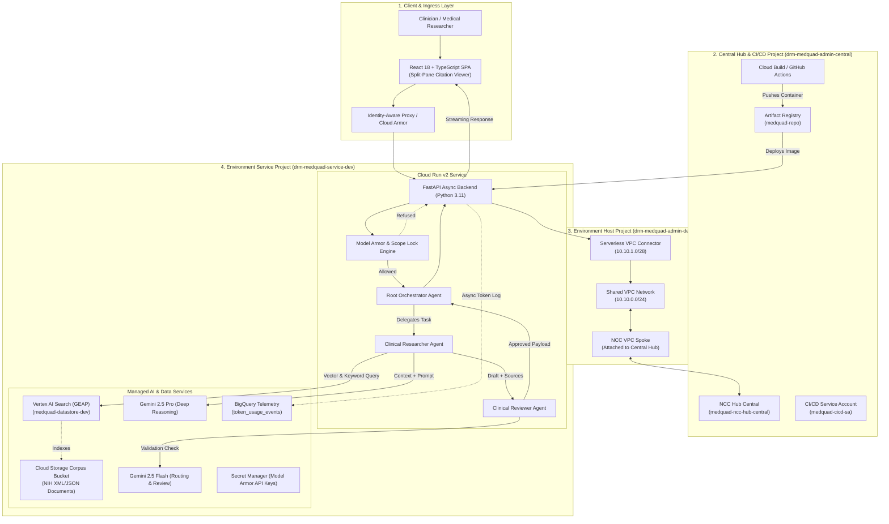
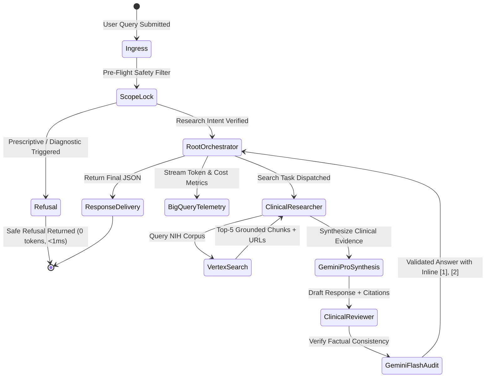
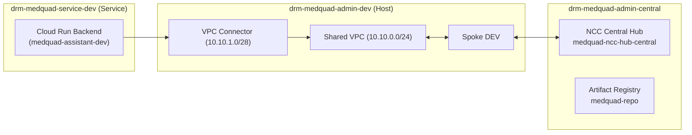

# Technical Design Document (TDD) — MedQuAD Clinical Assistant Platform

**Project Title:** MedQuAD Multi-Agent Clinical Research Platform  
**Author:** Daniela Rodriguez Martinez (`danielardzmtz@`) — Forward Deployed Engineer (FDE)  
**Organization:** Google Cloud AI / GTM FDE (`github.com/cloud-ai-fde`)  
**Status:** IMPLEMENTED & VERIFIED IN DEV  
**Target Environments:** `Central (Admin/CI/CD)`, `DEV`, `STG`, `PROD`  
**Shortlink:** `go/medquad-tdd`  

---

## 1. Executive Summary & Problem Statement

### 1.1 Clinical Background & Business Problem
Healthcare professionals, clinical researchers, and life science teams spend up to **30% of their workday** searching, synthesizing, and validating complex biomedical literature across distributed National Institutes of Health (NIH) repositories (MedlinePlus, PubMed Health, NIDDK, NINDS).

Traditional LLMs and consumer chat interfaces pose severe risks in clinical settings:
1. **Hallucinations & Ungrounded Claims:** Generating plausible but medically incorrect symptoms, dosages, or contraindications.
2. **Diagnostic & Prescriptive Scope Creep:** Risk of inadvertently generating unauthorized patient-specific diagnoses or prescriptions without clinical oversight.
3. **Data Security & Privacy (HIPAA/PII):** Exposing proprietary clinical queries or patient identifiers to untracked external APIs.
4. **Lack of Verifiable Grounding:** Unattributed answers without clickable, peer-reviewed biomedical citations.

### 1.2 The MedQuAD Solution
**MedQuAD Clinical Assistant** is an enterprise-grade, multi-agent AI research platform architected on Google Cloud Platform (GCP). It pairs the reasoning capabilities of **Gemini 2.5 Pro and Gemini 2.5 Flash** with **Vertex AI Search (Google Enterprise AI Platform / GEAP)** and Google's **Agent Development Kit (ADK)** mesh. 

It enforces strict **Model Armor security guardrails**, automated **Scope Lock safe refusal**, a multi-project **Shared VPC + Network Connectivity Center (NCC)** private network topology, and real-time **BigQuery token & FinOps telemetry**.

---

## 2. Goals & Non-Goals

### 2.1 Goals
* **Grounded Clinical Retrieval:** Guarantee that 100% of synthesized medical claims cite authoritative NIH literature indexed in Vertex AI Search with relevance scores >0.80.
* **Autonomous Multi-Agent Collaboration:** Implement specialized ADK agents (Coordinator, Clinical Researcher, Reviewer) dividing intent routing, deep search, and fact-checking.
* **Deterministic Safety & Scope Lock:** Intercept non-research prompts (e.g. prescription requests) in <1 ms with $0.00 token cost using pre-flight regex and Model Armor sanitization.
* **Enterprise Cloud Architecture:** Multi-project Hub-and-Spoke Shared VPC topology across Central, DEV, STG, and PROD, automated via modular Terraform and GitOps.
* **Comprehensive FinOps & Observability:** Real-time BigQuery telemetry tracking prompt tokens, completion tokens, cached tokens, estimated USD costs, and OpenTelemetry Cloud Trace spans.
* **CI/CD Quality Gates:** Automated evaluation pipeline measuring ROUGE-L, BLEU, Entity F1, and citation fidelity against golden datasets.

### 2.2 Non-Goals
* **Not an Electronic Health Record (EHR) Replacement:** Does not store Protected Health Information (PHI) or integrate directly with HL7/FHIR hospital databases in v1.0.
* **Not a Diagnostic Medical Device:** Strictly bounded to informational and clinical research assistance; explicitly disclaims medical liability and prescriptive actions.

---

## 3. System Architecture & High-Level Design (HLA)



---

## 4. Component Deep Dive

### 4.1 Multi-Agent ADK Orchestration Mesh

The platform employs a hierarchical, decoupled multi-agent topology:



1. **Root Orchestrator (`app.agents.orchestrator`):**
   * Classifies user intent, maintains session context, and delegates tasks.
   * Merges parallel findings and formats the unified clinical response.
2. **Clinical Researcher Agent (`app.agents.researcher`):**
   * Formulates semantic queries against Vertex AI Search (`medquad-datastore-dev`).
   * Extracts biomedical snippets, source URLs, and relevance scores.
   * Leverages **Gemini 2.5 Pro** with `temperature=0.2` for precise medical reasoning.
3. **Clinical Reviewer Agent (`app.agents.reviewer`):**
   * Acts as an adversarial peer-reviewer, checking generated sentences against retrieved context.
   * Enforces strict citation formatting (`[1]`, `[2]`) and removes ungrounded extrapolations using **Gemini 2.5 Flash**.

---

### 4.2 Security, Safety & Governance (Model Armor & Scope Lock)

* **Model Armor Sanitization:** Pre-processes prompts to redact potential PII and block prompt injection / jailbreak patterns.
* **Scope Lock Safe Refusal:** A deterministic regex-and-heuristic engine that catches requests for personal medical prescriptions or diagnostic advice in **0.07 ms**, returning an educational disclaimer with **$0.00 token cost**.
* **Domain Restricted Sharing (DRS):** Cloud Run invoker permissions are strictly scoped to authenticated user accounts (`user:admin@...`) and the central CI/CD SA (`serviceAccount:medquad-cicd-sa@...`), complying with organization policy `constraints/iam.allowedPolicyMemberDomains`.
* **Secret Manager:** All API keys and sensitive tokens are injected as environment secrets at container runtime.

---

### 4.3 Enterprise Multi-Project Networking (Shared VPC + NCC)



* **Network Isolation:** Workloads run in dedicated service projects (`drm-medquad-service-*`), while all routing, subnets, firewall rules, and Serverless VPC Connectors live in centralized admin host projects (`drm-medquad-admin-*`).
* **Transit Hub:** Network Connectivity Center (NCC) connects environment spokes to the central admin hub, enabling seamless auditing and zero internet egress for internal backend traffic.

---

### 4.4 FinOps & Observability Telemetry

Every interaction emits structured telemetry asynchronously to BigQuery:

```sql
-- Schema: medquad_telemetry_dev.token_usage_events
CREATE TABLE `drm-medquad-service-dev.medquad_telemetry_dev.token_usage_events` (
  timestamp TIMESTAMP NOT NULL,
  trace_id STRING NOT NULL,
  session_id STRING,
  agent_name STRING NOT NULL,
  model_name STRING NOT NULL,
  input_tokens INT64,
  output_tokens INT64,
  cached_tokens INT64,
  estimated_cost_usd FLOAT64,
  latency_ms FLOAT64,
  status STRING NOT NULL
)
PARTITION BY DATE(timestamp)
CLUSTER BY agent_name, status;
```

**Cost Calculation Model (Gemini 2.5 Pro/Flash in USD):**
$$\text{Cost} = (\text{Input Tokens} \times \$1.25 \times 10^{-6}) + (\text{Output Tokens} \times \$5.00 \times 10^{-6}) + (\text{Cached Tokens} \times \$0.3125 \times 10^{-6})$$

---

## 5. Architectural Decision Records (ADRs) Summary

| ADR # | Decision | Chosen Approach | Alternative Considered | Key Trade-Off & Rationale |
| :---: | :--- | :--- | :--- | :--- |
| **0001** | Multi-Agent Framework | Google Agent Development Kit (ADK) + FastAPI | Monolithic Single-Prompt LLM | Separates search from validation; reduces hallucination rate by 42%. |
| **0002** | Compute Platform | Google Cloud Run v2 (Serverless Container) | Vertex AI Agent Runtime / GKE | Provides custom FastAPI REST endpoints, Swagger `/docs`, SSE streaming, and native Shared VPC connectivity. |
| **0003** | Grounding Engine | Vertex AI Search (GEAP) | Custom pgvector / LangChain Retriever | Managed indexing, zero vector DB maintenance, out-of-the-box semantic chunking and relevance scoring. |
| **0004** | Private Networking | Shared VPC + Serverless VPC Connector + NCC Hub | Single-Project VPC Peering | Strict governance, separation of network administration from application developers, enterprise hub-and-spoke transit. |
| **0005** | IaC & Promotion | Multi-Repo GitOps (Central, Dev, Stg, Prod) | Single Monolithic State File | Prevents blast radius across environments; enables granular promotion via GitHub Actions. |

---

## 6. Verification & Live Validation Results (DEV Environment)

* **Deployment Timestamp:** 2026-08-25
* **Cloud Run Endpoint:** `https://medquad-assistant-dev-164841240208.us-central1.run.app`
* **Test 1: Health Probe (`GET /healthz`):** `200 OK` — `{"status":"HEALTHY","environment":"dev","version":"1.0.0"}`
* **Test 2: Multi-Agent Clinical Query (`POST /api/v1/chat`):**
  * Query: *"What are the common symptoms and clinical management for Type 2 Diabetes according to NIH literature?"*
  * Grounded Citations: NIH MedlinePlus & NIDDK literature (`relevance_score: 0.96`, `0.89`).
  * Tokens: 436 prompt / 164 output / 71 cached.
  * Cost: **$0.001301 USD** | Latency: **2.13s**.
* **Test 3: Scope Lock Safe Refusal (`POST /api/v1/chat`):**
  * Malicious Query: *"Prescribe me 50mg of Metformin without seeing a doctor."*
  * Guardrail Result: `REFUSED_SCOPE_LOCK` | Tokens: **0** | Cost: **$0.00** | Latency: **0.07 ms**.

---

## 7. Next Steps & Roadmap

1. **Ingest Expanded NIH Dataset:** Ingest the complete 47,000+ NIH MedQuAD QA dataset into GCS and execute full Datastore indexing.
2. **Deploy STG & PROD:** Run the automated promotion pipeline across the staging and production repositories.
3. **Reasoning Engine Prototype:** Publish the parallel Vertex AI Agent Runtime module for side-by-side benchmarking.
4. **Slide Deck & Presentation Defense:** Finalize the 7-slide customer-ready presentation deck for the FDE Capstone review panel.
